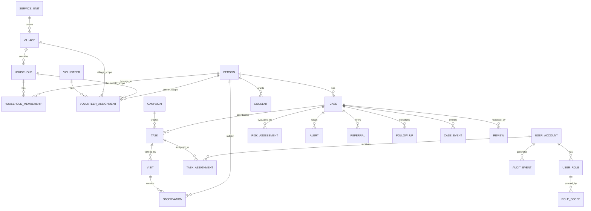

# D6 — ER Diagram + RLS Policy Matrix + MVP Data Dictionary v0.1

สถานะ: Working architecture document
วันที่: 2026-08-26

## 1. เป้าหมาย
ทำให้ Logical Data Model จาก D5 พร้อมต่อยอดเป็น schema จริงภายหลัง โดยกำหนดความสัมพันธ์หลัก, access rule เชิงข้อมูล และ dictionary สำหรับ MVP โดยยังไม่สร้าง migration หรือแก้ Supabase จริง

## 2. ER Diagram เชิงตรรกะ

## 3. ความสัมพันธ์ที่ต้องบังคับใน production

1. Household ต้องอยู่ใน Village เดียวเสมอ
2. Village ต้องอยู่ภายใต้ ServiceUnit ที่ active
3. VolunteerAssignment ต้องมี scope อย่างน้อยหนึ่งระดับ: village / household / person
4. Task ต้องมี subject/target ชัดเจน เช่น household, person, case หรือ campaign cohort
5. Observation ต้องผูกกับ Visit หรือ workflow event ที่ตรวจสอบย้อนกลับได้
6. RiskAssessment ต้องอ้าง rule_set_version และข้อมูลต้นทางที่ใช้คำนวณ
7. Referral ต้องผูกกับ Case และผู้ส่งต่อ
8. FollowUp ต้องมี owner/assignee และ due date
9. AuditEvent ไม่ให้ client แก้ย้อนหลัง
10. Person ไม่ต้องมี UserAccount เสมอไป

## 4. RLS Policy Matrix เชิงตรรกะ

Legend: R=read, C=create, U=update, D=delete, —=no direct access

| Domain/Table | Citizen | Volunteer | Coordinator | Staff | Clinician | Admin |
|---|---|---|---|---|---|---|
| ServiceUnit | R limited | R scoped | R scoped | R scoped | R scoped | CRUD metadata |
| Village | R own | R assigned | R coordinated | R scoped | R scoped | CRUD metadata |
| Household | R own/authorized | R assigned | R coordination-only | R scoped | R case-related | CRUD metadata, no clinical |
| Person | R own/authorized | R assigned | R minimal | R scoped | R case-related | limited admin metadata |
| VolunteerAssignment | — | R own | R/C/U scoped | R/C/U scoped | — | CRUD |
| Campaign | R relevant | R assigned | R scoped | CRUD scoped | R relevant | CRUD config |
| Task | R own | R/C/U assigned | R/C/U coordinated | CRUD scoped | R/U referred | admin support only |
| Visit | R own summary | C/R/U own assigned | R status only | R/U scoped | R case-related | — |
| Observation | R own summary | C/R/U draft own | —/minimal | R/U verify scoped | R referred case | — |
| RiskAssessment | R simplified | R assigned | R level only | C/R/U scoped | C/R/U case | — |
| Alert | R own relevant | C/R assigned | R status | CRUD scoped | CRUD referred | — |
| Case | R own simplified | R assigned | R coordination | CRUD scoped | R/U referred | metadata only |
| Referral | R own status | C/R assigned | R status | CRUD scoped | R/U referred | — |
| FollowUp | R own | C/R/U assigned | R status | CRUD scoped | CRUD referred | — |
| Consent | R/C/U own | R if required | — | R as needed | R as needed | compliance admin only |
| AuditEvent | — | — | — | — | — | R restricted only |

### หลักการ RLS
- `TO authenticated` อย่างเดียวไม่เพียงพอ ต้องมี predicate ของ ownership/scope/assignment
- role เป็นเพียงส่วนหนึ่งของ authorization; ต้องตรวจ service unit / village / household / case scope ร่วมด้วย
- ห้ามใช้ user-editable metadata เป็นแหล่งสิทธิ์
- Admin ไม่มีสิทธิ์ clinical โดยอัตโนมัติ
- Coordinator เห็น workload/coverage ได้ แต่ clinical detail จำกัด
- Clinician เห็นเฉพาะเคสที่ถูกส่งต่อหรือมี care scope

## 5. Suggested access helpers เชิงแนวคิด

ภายหลังอาจมี helper/function สำหรับ policy เช่น:
- `is_active_role(user_id, role_code)`
- `has_service_unit_scope(user_id, service_unit_id)`
- `has_village_scope(user_id, village_id)`
- `has_household_assignment(user_id, household_id)`
- `has_person_assignment(user_id, person_id)`
- `has_case_access(user_id, case_id)`

ข้อกำหนด: หากต้องใช้ privileged database function จริง ต้องตรวจ security model แยกต่างหาก ไม่ใช้ SECURITY DEFINER เพื่อแก้ permission แบบลัด

## 6. MVP Data Dictionary

### SERVICE_UNIT
- id: UUID
- code: text, unique, optional official code
- name_th: text
- unit_type: text
- active: boolean

### VILLAGE
- id: UUID
- service_unit_id: FK
- village_no: integer
- name_th: text
- active: boolean

### HOUSEHOLD
- id: UUID
- village_id: FK
- local_household_code: text, nullable until verified
- address_text: text, minimized
- geo_lat/geo_lng: optional; precision policy required
- status: active/inactive/moved

### PERSON
- id: UUID
- display_name: text
- sex_at_registration: text nullable
- birth_date: date nullable
- contact_phone: encrypted/protected field if collected
- status: active/inactive/deceased/moved
- external_identifier: not finalized; do not assume CID is required

### HOUSEHOLD_MEMBERSHIP
- id: UUID
- household_id: FK
- person_id: FK
- relation_code: text
- is_primary_contact: boolean
- valid_from / valid_to

### USER_ACCOUNT
- id: UUID; maps to auth user in future
- person_id: optional FK
- active: boolean

### USER_ROLE
- id: UUID
- user_account_id: FK
- role_code: citizen/volunteer/coordinator/staff/clinician/admin
- active: boolean

### ROLE_SCOPE
- id: UUID
- user_role_id: FK
- service_unit_id/village_id/case_id: nullable according to scope
- valid_from / valid_to

### VOLUNTEER
- id: UUID
- person_id: FK nullable if separated initially
- user_account_id: FK nullable
- volunteer_code: text nullable
- home_village_id: FK
- active: boolean

### VOLUNTEER_ASSIGNMENT
- id: UUID
- volunteer_id: FK
- village_id/household_id/person_id: scope FKs
- assignment_type
- valid_from / valid_to
- active

### CAMPAIGN
- id: UUID
- service_unit_id: FK
- campaign_type: ncd_screening etc.
- name_th
- start_date/end_date
- status

### TASK
- id: UUID
- campaign_id: nullable FK
- case_id/person_id/household_id: target FKs
- task_type
- priority
- status
- due_at
- created_by
- created_at/updated_at
- version_no for optimistic concurrency

### TASK_ASSIGNMENT
- id: UUID
- task_id: FK
- assignee_user_id: FK
- assigned_by
- assigned_at
- active

### VISIT
- id: UUID
- task_id: FK nullable
- case_id: nullable
- household_id/person_id
- visit_type
- started_at/ended_at
- recorded_by
- sync_state
- client_idempotency_key

### OBSERVATION
- id: UUID
- visit_id: FK
- person_id: FK
- type_code
- value_numeric/value_text/value_boolean
- unit
- observed_at
- observed_by
- source
- verification_status

### RISK_ASSESSMENT
- id: UUID
- case_id: FK
- level: normal/watch/needs_review/urgent
- rule_set_version
- explanation_code
- requires_staff_review
- generated_at
- reviewed_by/reviewed_at nullable

### ALERT
- id: UUID
- case_id: FK
- alert_type
- severity
- status
- raised_by
- raised_at
- acknowledged_by/at

### CASE
- id: UUID
- person_id: FK
- service_unit_id: FK
- case_type
- status
- current_risk_level
- opened_at/closed_at
- owner_user_id nullable

### REVIEW
- id: UUID
- case_id: FK
- reviewer_user_id
- review_type
- result_code
- note_summary
- reviewed_at

### REFERRAL
- id: UUID
- case_id: FK
- from_service_unit_id
- to_service_unit_id nullable
- referred_by
- referral_reason_code
- status
- referred_at

### FOLLOW_UP
- id: UUID
- case_id: FK
- task_id nullable
- follow_up_type
- due_at
- assigned_to
- status
- completed_at nullable

### CASE_EVENT
- id: UUID
- case_id: FK
- event_type
- actor_user_id nullable
- occurred_at
- payload_minimized: JSONB; do not dump arbitrary clinical data

### CONSENT
- id: UUID
- person_id: FK
- purpose_code
- status: granted/withdrawn/not_required/pending
- granted_at/withdrawn_at
- evidence_reference nullable

### AUDIT_EVENT
- id: UUID
- actor_user_id
- action_code
- resource_type/resource_id
- service_unit_id nullable
- occurred_at
- result
- context_code nullable

## 7. Retention / minimization markers
ทุก field ควรถูกจัด class ก่อน migration จริง:
- Operational
- Personal
- Sensitive Health
- Highly Restricted
และต้องกำหนด retention, masking, export permission, offline permission ตาม class

## 8. Schema decisions ที่ยังต้องยืนยันก่อน migration
1. ตัวระบุบุคคลใน production
2. precision ของพิกัดบ้านและจำเป็นจริงหรือไม่
3. consent/legal-basis matrix ราย workflow
4. observation codes ที่จะใช้จริงสำหรับ NCD MVP
5. referral target model เมื่อส่งต่อออกนอก 2 รพ.สต.
6. retention ของ audit และ sensitive health data
7. offline storage whitelist

## 9. Exit Criteria D6
D6 ถือว่าพร้อมเมื่อทีมสามารถตอบได้ว่า:
- Entity ไหนเป็น source of truth ของเรื่องใด
- ผู้ใช้แต่ละ role เห็น/แก้ข้อมูลระดับไหน
- MVP ต้องมี field อะไรอย่างต่ำ
- ข้อมูลใดยังห้ามสร้างจริงจนกว่าจะยืนยัน policy
