# KCG Health OSM — Canonical Database Design v0.2

สถานะ: **ACTIVE / CANONICAL DATA DESIGN**
วันที่เริ่มใช้: 2026-08-27

เอกสารนี้เป็นแบบฐานข้อมูลเชิงตรรกะหลักของ Product Definition v0.2 และแทนแบบจำลองเก่าที่ใช้ `Visit / Observation / Case / NCD` เป็นแกนระบบ

ยัง **ไม่ใช่ migration production** และยังไม่อนุญาตให้เชื่อมฐานข้อมูลจริงก่อน Phase 6 ตาม `MASTER-ROADMAP.md`

## 1. Source of Truth

เมื่อเอกสารด้านข้อมูลขัดกัน ให้ใช้ลำดับนี้:

1. `docs/product/PRODUCT-DEFINITION-v0.2.md`
2. `PRD.md`
3. `MASTER-ROADMAP.md`
4. เอกสารนี้ `DATABASE-DESIGN-v0.2.md`
5. `AGENTS.md`
6. architecture documents รุ่นเก่าเป็น historical reference

## 2. Product Data Core

แกนข้อมูลใหม่คือ:

`Form Template → Form Version → Campaign → Audience → Campaign Recipient → Submission → Review → Follow-up / Appointment / Referral → Export`

และผูกกับโครงสร้างพื้นที่:

`Tambon / Service Unit → Village → Volunteer → Household → Person`

หลักสำคัญ:
- `Person` ไม่เท่ากับ `UserAccount`
- แบบฟอร์มที่ publish แล้วต้องอ้าง `FormVersion` ที่ immutable
- audience ที่ resolve แล้วต้อง materialize เป็น `CampaignRecipient`
- submission ต้องเก็บ provenance ว่าใครเป็น subject และใครเป็นคนกรอกจริง
- อสม.เข้าถึงได้เฉพาะ household/person ใน active assignment
- clinical rule ไม่ใช่แกน schema และห้าม hard-code โดยไม่มีผู้เชี่ยวชาญอนุมัติ

## 3. Canonical Entity Set

### Geography & Organization
- `tambons`
- `service_units`
- `villages`

### People & Identity
- `persons`
- `households`
- `household_memberships`
- `user_accounts`
- `user_roles`
- `role_scopes`
- `volunteers`
- `volunteer_assignments`

### Forms
- `form_templates`
- `form_versions`
- `form_sections`
- `form_questions`
- `question_options`

### Campaign & Audience
- `campaigns`
- `audience_definitions`
- `audience_rules`
- `campaign_recipients`

### Submission
- `submissions`
- `submission_answers`

### Review & Action
- `submission_reviews`
- `follow_ups`
- `appointments`
- `referrals`

### Integration / Governance
- `export_jobs`
- `consents`
- `audit_events`
- `data_correction_requests`

### Offline / Sync
Offline queue อยู่ฝั่ง client เป็นหลัก แต่ server-side mutation ที่รับ sync ต้องรองรับ:
- `client_generated_id`
- `idempotency_key`
- request/mutation deduplication

## 4. ER Diagram

```mermaid
erDiagram
  TAMBON ||--o{ SERVICE_UNIT : contains
  SERVICE_UNIT ||--o{ VILLAGE : covers
  VILLAGE ||--o{ HOUSEHOLD : contains
  HOUSEHOLD ||--o{ HOUSEHOLD_MEMBERSHIP : has
  PERSON ||--o{ HOUSEHOLD_MEMBERSHIP : belongs_to

  PERSON ||--o| USER_ACCOUNT : may_have
  USER_ACCOUNT ||--o{ USER_ROLE : has
  USER_ROLE ||--o{ ROLE_SCOPE : scoped_by

  PERSON ||--o| VOLUNTEER : may_be
  VOLUNTEER ||--o{ VOLUNTEER_ASSIGNMENT : receives
  VILLAGE ||--o{ VOLUNTEER_ASSIGNMENT : village_scope
  HOUSEHOLD ||--o{ VOLUNTEER_ASSIGNMENT : household_scope
  PERSON ||--o{ VOLUNTEER_ASSIGNMENT : person_scope

  FORM_TEMPLATE ||--o{ FORM_VERSION : versions
  FORM_VERSION ||--o{ FORM_SECTION : contains
  FORM_SECTION ||--o{ FORM_QUESTION : contains
  FORM_QUESTION ||--o{ QUESTION_OPTION : options

  FORM_VERSION ||--o{ CAMPAIGN : used_by
  CAMPAIGN ||--|| AUDIENCE_DEFINITION : targets
  AUDIENCE_DEFINITION ||--o{ AUDIENCE_RULE : contains
  CAMPAIGN ||--o{ CAMPAIGN_RECIPIENT : materializes
  PERSON ||--o{ CAMPAIGN_RECIPIENT : targeted
  HOUSEHOLD ||--o{ CAMPAIGN_RECIPIENT : context
  VOLUNTEER ||--o{ CAMPAIGN_RECIPIENT : responsible_volunteer

  CAMPAIGN_RECIPIENT ||--o{ SUBMISSION : produces
  FORM_VERSION ||--o{ SUBMISSION : answered_against
  PERSON ||--o{ SUBMISSION : subject
  USER_ACCOUNT ||--o{ SUBMISSION : submitted_by
  SUBMISSION ||--o{ SUBMISSION_ANSWER : contains
  FORM_QUESTION ||--o{ SUBMISSION_ANSWER : answers

  SUBMISSION ||--o{ SUBMISSION_REVIEW : reviewed
  SUBMISSION ||--o{ FOLLOW_UP : may_create
  SUBMISSION ||--o{ APPOINTMENT : may_create
  SUBMISSION ||--o{ REFERRAL : may_create

  USER_ACCOUNT ||--o{ AUDIT_EVENT : generates
  PERSON ||--o{ CONSENT : grants
  CAMPAIGN ||--o{ EXPORT_JOB : exports
```

## 5. Table Definitions

### 5.1 tambons
- `id UUID PK`
- `code TEXT nullable unique`
- `name_th TEXT not null`
- `province_code TEXT nullable`
- `district_code TEXT nullable`
- `active BOOLEAN not null default true`
- timestamps

### 5.2 service_units
- `id UUID PK`
- `tambon_id UUID FK tambons`
- `code TEXT nullable unique`
- `name_th TEXT not null`
- `unit_type TEXT nullable`
- `active BOOLEAN default true`
- timestamps

### 5.3 villages
- `id UUID PK`
- `service_unit_id UUID FK service_units`
- `village_no INTEGER not null`
- `name_th TEXT not null`
- `active BOOLEAN default true`
- timestamps

Recommended unique constraint: `(service_unit_id, village_no)` after local boundary validation.

### 5.4 households
- `id UUID PK`
- `village_id UUID FK villages not null`
- `local_household_code TEXT nullable`
- `address_text TEXT nullable` — minimized
- `status TEXT` — active/inactive/moved
- timestamps

Do not require precise GPS unless later approved by privacy/design gate.

### 5.5 persons
- `id UUID PK`
- `display_name TEXT not null`
- `birth_date DATE nullable`
- `sex_at_registration TEXT nullable`
- `contact_phone TEXT nullable` — protected field when backend exists
- `status TEXT`
- `external_identifier TEXT nullable` — exact production identifier intentionally undecided
- timestamps

Do not assume CID is mandatory.

### 5.6 household_memberships
- `id UUID PK`
- `household_id UUID FK households`
- `person_id UUID FK persons`
- `relation_code TEXT nullable`
- `is_primary_contact BOOLEAN default false`
- `valid_from TIMESTAMPTZ nullable`
- `valid_to TIMESTAMPTZ nullable`
- `active BOOLEAN default true`
- timestamps

Constraint: a person may have historical memberships; active membership policy must prevent invalid duplicate active household relations according to future business rule.

### 5.7 user_accounts
Logical application account mapped to auth provider in Phase 6.
- `id UUID PK`
- `auth_user_id UUID nullable unique`
- `person_id UUID FK persons nullable`
- `active BOOLEAN default true`
- timestamps

### 5.8 user_roles
- `id UUID PK`
- `user_account_id UUID FK user_accounts`
- `role_code TEXT`
- `active BOOLEAN default true`
- `valid_from/valid_to`

Allowed role foundation:
- `citizen`
- `volunteer`
- `coordinator`
- `staff`
- `clinician`
- `admin`

### 5.9 role_scopes
- `id UUID PK`
- `user_role_id UUID FK user_roles`
- `service_unit_id UUID nullable`
- `village_id UUID nullable`
- `valid_from/valid_to`
- `active BOOLEAN`

Case-specific scopes are not part of the core v0.2 model unless later justified.

### 5.10 volunteers
- `id UUID PK`
- `person_id UUID FK persons nullable`
- `user_account_id UUID FK user_accounts nullable`
- `home_village_id UUID FK villages nullable`
- `volunteer_code TEXT nullable`
- `active BOOLEAN`
- timestamps

### 5.11 volunteer_assignments
This table is the authoritative responsibility history.
- `id UUID PK`
- `volunteer_id UUID FK volunteers`
- `village_id UUID FK villages nullable`
- `household_id UUID FK households nullable`
- `person_id UUID FK persons nullable`
- `assignment_type TEXT`
- `start_at TIMESTAMPTZ not null`
- `end_at TIMESTAMPTZ nullable`
- `active BOOLEAN not null default true`
- `assigned_by_user_id UUID nullable`
- timestamps

Rule: at least one scope target must be populated. Household assignment is preferred for routine responsibility where possible; person-level scope may override/extend only when business rules require it.

### 5.12 form_templates
Identity of a logical form across versions.
- `id UUID PK`
- `service_unit_id UUID nullable`
- `name_th TEXT not null`
- `description TEXT nullable`
- `status TEXT` — draft/active/archived
- `created_by_user_id UUID`
- timestamps

### 5.13 form_versions
Immutable once published.
- `id UUID PK`
- `form_template_id UUID FK form_templates`
- `version_no INTEGER not null`
- `status TEXT` — draft/published/retired
- `title_snapshot TEXT not null`
- `description_snapshot TEXT nullable`
- `published_at TIMESTAMPTZ nullable`
- `published_by_user_id UUID nullable`
- `schema_version INTEGER default 1`
- timestamps

Unique: `(form_template_id, version_no)`.

Rule: published rows are never edited in-place; changes create a new version.

### 5.14 form_sections
- `id UUID PK`
- `form_version_id UUID FK form_versions`
- `title TEXT nullable`
- `description TEXT nullable`
- `order_index INTEGER not null`

### 5.15 form_questions
- `id UUID PK`
- `form_version_id UUID FK form_versions`
- `form_section_id UUID FK form_sections nullable`
- `question_key TEXT not null`
- `question_type TEXT not null`
- `label TEXT not null`
- `help_text TEXT nullable`
- `required BOOLEAN default false`
- `order_index INTEGER not null`
- `validation_config JSONB nullable`
- `visibility_config JSONB nullable`

Allowed Phase 1 foundation types:
- `short_text`
- `long_text`
- `number`
- `checkbox`
- `radio`
- `select`
- `date`
- `time`
- `yes_no`
- `single_choice`
- `multiple_choice`

Unique recommended: `(form_version_id, question_key)`.

### 5.16 question_options
- `id UUID PK`
- `form_question_id UUID FK form_questions`
- `value_code TEXT not null`
- `label TEXT not null`
- `order_index INTEGER not null`

### 5.17 campaigns
- `id UUID PK`
- `service_unit_id UUID FK service_units`
- `form_version_id UUID FK form_versions not null`
- `name_th TEXT not null`
- `description TEXT nullable`
- `status TEXT` — draft/published/closed/cancelled
- `starts_at/ends_at nullable`
- `created_by_user_id UUID`
- `published_at nullable`
- timestamps

Rule: only published `FormVersion` can be attached to a published campaign.

### 5.18 audience_definitions
- `id UUID PK`
- `campaign_id UUID FK campaigns unique`
- `target_type TEXT` — person/household/village/rule_segment/mixed
- `definition_version INTEGER default 1`
- `created_by_user_id UUID`
- timestamps

### 5.19 audience_rules
- `id UUID PK`
- `audience_definition_id UUID FK`
- `rule_type TEXT`
- `operator TEXT`
- `field_key TEXT nullable`
- `value JSONB nullable`
- `order_index INTEGER`

Rule language must remain generic; no production clinical thresholds without approved rule governance.

### 5.20 campaign_recipients
Materialized targeting snapshot.
- `id UUID PK`
- `campaign_id UUID FK campaigns`
- `person_id UUID FK persons not null`
- `household_id UUID FK households nullable`
- `village_id UUID FK villages nullable`
- `responsible_volunteer_id UUID FK volunteers nullable`
- `source_rule_id UUID nullable`
- `status TEXT` — assigned/in_progress/submitted/closed/cancelled
- `resolved_at TIMESTAMPTZ not null`
- timestamps

Unique recommended: `(campaign_id, person_id)` unless a later use case explicitly allows multiple recipient instances.

### 5.21 submissions
Provenance-critical table.
- `id UUID PK`
- `campaign_recipient_id UUID FK campaign_recipients`
- `campaign_id UUID FK campaigns`
- `form_version_id UUID FK form_versions`
- `subject_person_id UUID FK persons`
- `submitted_by_user_id UUID FK user_accounts`
- `submission_mode TEXT` — SELF/PROXY
- `status TEXT` — draft/submitted/requires_review/reviewed/action_required/completed
- `client_generated_id UUID not null`
- `idempotency_key TEXT not null`
- `started_at TIMESTAMPTZ nullable`
- `submitted_at TIMESTAMPTZ nullable`
- timestamps

Unique: `client_generated_id`; unique or scoped-unique `idempotency_key` according to server strategy.

Proxy rule: when `submission_mode=PROXY`, submitter must have active assignment/authorized scope to subject person at submission time.

### 5.22 submission_answers
- `id UUID PK`
- `submission_id UUID FK submissions`
- `form_question_id UUID FK form_questions`
- `value_json JSONB nullable`
- `answered_at TIMESTAMPTZ nullable`

Unique recommended: `(submission_id, form_question_id)`.

Answer format validation is performed against immutable question definition from the linked `FormVersion`.

### 5.23 submission_reviews
- `id UUID PK`
- `submission_id UUID FK submissions`
- `reviewer_user_id UUID FK user_accounts`
- `review_status TEXT`
- `result_code TEXT nullable`
- `note_summary TEXT nullable`
- `reviewed_at TIMESTAMPTZ`
- timestamps

Review policy belongs to form/campaign configuration; review records preserve actual reviewer action.

### 5.24 follow_ups
- `id UUID PK`
- `submission_id UUID FK submissions`
- `assigned_to_user_id UUID nullable`
- `follow_up_type TEXT`
- `status TEXT`
- `due_at TIMESTAMPTZ nullable`
- `completed_at TIMESTAMPTZ nullable`
- `note_summary TEXT nullable`
- timestamps

### 5.25 appointments
- `id UUID PK`
- `submission_id UUID FK submissions`
- `service_unit_id UUID FK service_units`
- `scheduled_at TIMESTAMPTZ`
- `status TEXT`
- `created_by_user_id UUID`
- timestamps

### 5.26 referrals
- `id UUID PK`
- `submission_id UUID FK submissions`
- `from_service_unit_id UUID FK service_units`
- `to_service_unit_id UUID nullable`
- `destination_text TEXT nullable`
- `reason_code TEXT nullable`
- `status TEXT`
- `referred_by_user_id UUID`
- `referred_at TIMESTAMPTZ`
- timestamps

This is coordination data, not a full clinical referral record/EMR.

### 5.27 export_jobs
- `id UUID PK`
- `campaign_id UUID FK campaigns nullable`
- `requested_by_user_id UUID`
- `export_type TEXT`
- `status TEXT`
- `format_version TEXT`
- `created_at/completed_at`
- `output_reference TEXT nullable`

Do not store public URLs to sensitive exports.

### 5.28 consents
Logical placeholder; exact legal basis/consent model finalized in Phase 9.
- `id UUID PK`
- `person_id UUID FK persons`
- `purpose_code TEXT`
- `status TEXT`
- `granted_at/withdrawn_at nullable`
- `evidence_reference TEXT nullable`

### 5.29 audit_events
Append-oriented.
- `id UUID PK`
- `actor_user_id UUID nullable`
- `action_code TEXT`
- `resource_type TEXT`
- `resource_id UUID nullable`
- `service_unit_id UUID nullable`
- `result TEXT`
- `context_code TEXT nullable`
- `occurred_at TIMESTAMPTZ`

Clients must not be able to rewrite audit history.

### 5.30 data_correction_requests
- `id UUID PK`
- `requested_by_user_id UUID`
- `resource_type TEXT`
- `resource_id UUID`
- `requested_changes JSONB`
- `status TEXT`
- `reviewed_by_user_id UUID nullable`
- `reviewed_at TIMESTAMPTZ nullable`
- timestamps

Used for controlled correction of master data rather than silent overwrites.

## 6. Core Invariants

1. `Person` and `UserAccount` are separate identities.
2. Household responsibility is history-based through `VolunteerAssignment`; do not store only `household.volunteer_id`.
3. Published `FormVersion` is immutable.
4. Published campaign points to one immutable `FormVersion`.
5. Audience resolution creates materialized `CampaignRecipient` rows before collection begins.
6. Every submission identifies the subject person and actual submitting account.
7. Proxy submission requires authorized active scope at the time of submission.
8. Submission answers must refer to questions from the same `FormVersion` as the submission.
9. Server-side idempotency is required for mutation replay/offline sync.
10. Audit records are append-oriented and protected from client rewrite.
11. No production clinical threshold is embedded as a database constraint.
12. No official-system integration assumptions are embedded in core tables.

## 7. Status Foundations

### Form Version
`draft → published → retired`

### Campaign
`draft → published → closed | cancelled`

### Campaign Recipient
`assigned → in_progress → submitted → closed`

### Submission
`draft → submitted → requires_review → reviewed → action_required → completed`

Not every submission must pass through every state; policy determines valid transitions.

### Follow-up / Appointment / Referral
Each action uses explicit state machines defined in its phase and covered by tests before production.

## 8. Authorization / RLS Design Principles for Phase 6

Actual RLS policies are implemented only in Phase 6, but schema must support these predicates:

### Citizen
- own Person / explicitly authorized relation only
- own campaign recipients/submissions only

### Volunteer
- only active assigned villages/households/persons
- only campaign recipients tied to allowed scope
- may create proxy submissions only for allowed subject persons

### Coordinator
- operational scope for assigned area
- no automatic unrestricted health-detail access

### Staff / Clinician
- service-unit/role scope
- review/follow-up/referral according to explicit permissions

### Admin
- system/configuration administration
- no automatic clinical-data access

RLS rule must combine role + scope + assignment/ownership. `TO authenticated` alone is never sufficient.

## 9. Sensitive Data Classification

### Operational
campaign state, assignment state, progress counts, appointment status

### Personal
name, birth date, household/address, phone

### Sensitive Health
submission answers when they contain health information, review notes, follow-up/referral reasons

### Highly Restricted
consent evidence, raw attachments if later introduced, security/audit-sensitive context

Before production migration, each column must receive classification, retention, export permission and offline-storage policy.

## 10. Index / Constraint Plan

Future migration should include at least:
- FK indexes for all major relationships
- `(service_unit_id, village_no)` unique after local validation
- `(form_template_id, version_no)` unique
- `(form_version_id, question_key)` unique
- `(campaign_id, person_id)` unique for recipients
- `(submission_id, form_question_id)` unique
- unique `client_generated_id`
- idempotency lookup index/unique strategy
- active assignment lookup indexes by volunteer/household/person/time
- submission status/campaign indexes for dashboard/review queues

## 11. Deliberately Excluded from Core v0.2

These are not canonical core entities now:
- `Visit`
- generic `Observation`
- `RiskAssessment`
- `Case`
- `Alert`
- NCD-specific tables

They may be reintroduced later only as generic, justified extensions through an architecture decision if real requirements demand them. Existing v0.1 documents mentioning them are historical references.

## 12. Migration Timing

### Phase 0–5
- domain types + repository interfaces + synthetic mocks only
- no production database

### Phase 6
- choose/finalize backend implementation
- convert this logical design into migrations
- implement Auth/RLS/server authorization
- synthetic staging first
- positive + negative security tests required

### Phase 9
- privacy/security/legal/retention approval before controlled real-data pilot

## 13. Decisions Still Intentionally Deferred

These are not blockers for Phase 0–5:
- exact production citizen identifier / CID mapping
- final OTP/account provider
- precise consent/legal-basis matrix
- retention periods
- offline whitelist for sensitive fields
- Smart อสม. export/integration contract
- exact clinical review rules

They must be resolved at the Roadmap phase where they become necessary, not prematurely.

## 14. Database Design Freeze Rule

This document is considered sufficient to build Phase 0–5 domain/repository contracts.

Do **not** create another competing data-model document for ordinary implementation changes.
If a material architecture change is required:
1. record an ADR under `docs/decisions/`
2. explain why this canonical model is insufficient
3. update this document deliberately
4. update tests/interfaces impacted

This prevents repeated redesign and keeps implementation moving.
